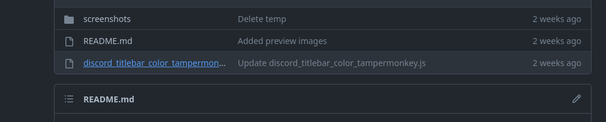
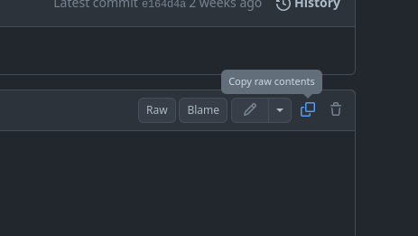
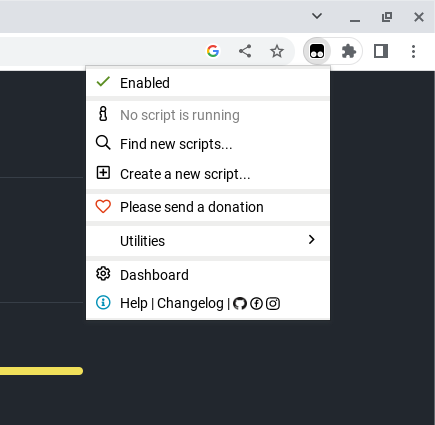

# Colored titlebar for Discord
Tampermonkey script for changing Discord's titlebar color.

#### Before
</img>

#### After
</img>

## Installation Steps

### Step 1. Install Tampermonkey
* [Chrome](https://chrome.google.com/webstore/detail/tampermonkey/dhdgffkkebhmkfjojejmpbldmpobfkfo) (Also applies to other Chromium based browsers, such as Brave or Microsoft Edge)
* [Firefox](https://addons.mozilla.org/en-US/firefox/addon/tampermonkey/)

### Step 2. Back on this repo, click on the script file.
</img>

### Step 3. Click on the copy icon to copy all code from the script.
</img>

### Step 4. Click on the Tampermonkey extension.
</img>
